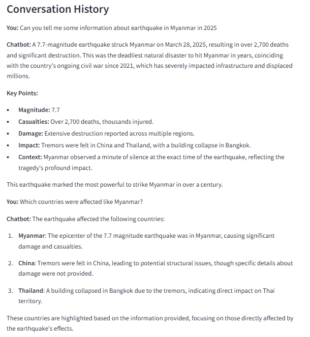

# AI News Chatbot

- **Overview**: An intelligent chatbot for context-aware news updates using AI.
- **Components**:
  - News data collection from CNN.
  - Vector database creation for semantic search.
  - Streamlit-based chatbot UI with LLM integration.
- **Purpose**: Ideal for learning, research, or news-based chatbot development.

## Requirements

- Libraries: `requests`, `beautifulsoup4`, `langchain`, `langchain-community`,  `streamlit`, `faiss-cpu`, `langchain_ollama` (or `faiss-gpu`).
- Embedding Models: `mxbai-embed-large-v1-f16.gguf` (from GPT4All).

## Installation

- Clone repo: `git clone <repository_url> && cd ai-news-chatbot`
- Install libraries: 
```bash
pip install -r requirements.txt
pip install requests beautifulsoup4 langchain langchain-community langchain-ollama streamlit faiss-cpu 
```


- Set up Ollama:
  - Install: [Ollama site](https://ollama.ai/)
  - Run: `ollama serve`
  - Pull model: `ollama pull deepseek-r1:8b`
- Download embedding models:
  - Create `models/` folder.
  - Add files from [GPT4All](https://gpt4all.io/).

## Usage

- **Collect News**:
  - Run: `python src/data_processing/prepare_data.py`
  - Output: `.txt` files in `cnn_articles/`.
- **Create Vector DB**:
  - Run: `python src/data_processing/create_vector_db.py`
  - Output: Database in `vector_db_news/`.
- **Launch Chatbot**:
  - Run: `python -m streamlit run src/chatbot.py`
  - Ask news-related questions.
## Demo
- Below is a screenshot of the chatbot in action, answering questions about recent news events

## Project Structure

- `cnn_articles/` - Crawled CNN articles.
- `models/` - Embedding models.
- `vector_db_news/` - Vector database.
- `chatbot.py` - Main chatbot script.
- `prepare_data.py` - CNN crawler.
- `create_vector_db.py` - Vector DB creator.

## Notes

- Ensure Ollama is running.
- Check `vector_db_news` path if errors occur.


## License

- MIT License ([LICENSE](LICENSE)).
